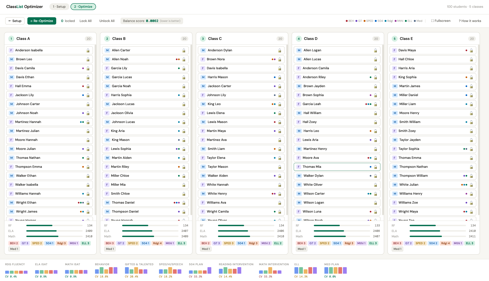

# Class List Builder

Create balanced class lists in minutes.



This tool distributes students across classrooms while balancing academic scores, intervention needs, gender, and class size. It runs entirely in your browser. **Student data never leaves your computer.**

---

## Why Use It?

Building fair class lists by hand takes too long. You're juggling a dozen factors at once, and it's hard to keep them all balanced. This tool speeds that up.

- **Saves time.** Import a roster and get balanced lists in minutes.
- **Balances everything at once.** Scores, SPED, Extended Learning, ELL, behavior, interventions, gender, and class size. Stop juggling factors one by one.
- **Handles constraints.** Keep siblings together. Separate students who shouldn't be in the same class.
- **Gives consistent results.** The same data produces the same output. You and your teammates can reproduce your work.
- **Keeps data private.** Nothing uploads. Nothing goes to a server. It runs in your browser and works offline.
- **Handles any size.** Small schools or large districts. The optimization runs in seconds even with thousands of students.

---

## Try It Now

**[Use it in your browser](https://armstrys.github.io/class-list-builder/)** — No download needed. Your data stays local.

## Download & Open

Prefer an offline copy?

1. Go to the **[Releases](../../releases)** page
2. Download the latest `class-list-builder-vX.Y.Z.html` file
3. Double-click to open in any browser

That's it. No installation, no account, no internet needed.

---

## Walkthrough

### Step 1 — Configure Your Criteria

Click **Settings** in the top-right to set up what the optimizer balances.

**Numeric criteria** are score columns where higher numbers mean stronger performance (reading, math, language scores on a 0–100 scale). The optimizer balances the average score of each class. **Scores are optional.** Remove those criteria or leave the columns blank if you don't have them.

**Flag criteria** are yes/no attributes (Extended Learning, SPED, ELL, behavior). The optimizer spreads students with each flag evenly across classes.

The optimizer always balances **gender** and **class size** automatically. You don't configure those.

**Weights** control how hard the optimizer works to balance each factor. A weight of `2.0` means that criterion is twice as important as one with weight `1.0`. The defaults work for most schools. Raise a weight if one factor matters most.

---

### Step 2 — Set Up Your Classes

In the **Teachers / Classes** panel on the left:

- Set the **number of classes**
- Name each class: teacher names, room numbers, or whatever works

---

### Step 3 — Add Your Students

**Option A: Import a CSV** (recommended for most rosters)

1. Click **Import CSV** and paste your data

Your CSV needs at minimum a `name` column and a `gender` column (`M` or `F`). All score and flag columns are optional. Leave them blank if you don't have that data. For flag columns, use `1` or `yes` (or `true`, `y`, `x`) for yes, and `0` or leave blank for no.

**Import appends** to your current student list. Click **Clear All** first if you want to replace your entire list.

**Constraint Columns (optional):**
- `keep_apart_group` — students with the same value stay in different classes
- `keep_together_group` — students with the same value stay in the same class

Example CSV:
```
name,gender,readingScore,keep_apart_group,keep_together_group
Alice,F,85,1,
Bob,M,78,1,
Charlie,M,70,,1
Diana,F,92,,1
```

**Option B: Add students manually**

Click **+ Add Student** to enter students one at a time.

**Option C: Try sample data**

Click **Sample Data** to generate a randomized roster for testing. This creates realistic test data so you can see how the optimizer works before entering real students.

**Need a template?**

Generate sample data first, then click **Save Students** to save a CSV with the correct column headers for your criteria configuration. Use that as a template for your real data.

---

### Step 4 — Optimize

Click **Optimize Classes** at the bottom of the screen. The optimizer runs automatically (usually in under a second) and takes you to your results.

---

## Understanding Your Results

### Balance Score

The **Balance score** in the toolbar tells you how evenly your classes are distributed across all criteria. Lower is better.

| Score | Color | What it means |
|-------|-------|---------------|
| < 0.05 | 🟢 Green | Excellent — classes are very evenly balanced |
| 0.05–0.15 | 🟡 Amber | Good — minor imbalances remain |
| > 0.15 | 🔴 Red | Notable imbalance — consider re-optimizing or reviewing manually |

With a typical roster, the optimizer usually reaches green.

### Per-Class Stats

At the bottom of each class column:
- **Score bars:** each bar shows how that class's average compares across all classes. All bars at the same height means perfect balance.
- **Flag badges:** a count of students with each active flag (e.g., "ExtL 3", "SPED 2")

### Stats Strip

The strip at the bottom of the screen shows a mini bar chart for every criterion across all classes. The **CV%** number under each chart measures how spread out the classes are. Lower is better. Green means you're in good shape.

---

## Fine-Tuning

### Drag and Drop

Drag any student card to move them to a different class. The balance score updates live so you can see the impact of each move. There is no undo for drag-and-drop. If you move someone by mistake, drag them back, or click **Re-Optimize** to start fresh from the current locked assignments.

Click on any student card to view their full detail.

### Locking Students

Sometimes a student must be in a specific class (a separation request, a particular teacher, a support need). Use the lock button on any student card to **lock** them to their current class.

Once you've locked the students who need to stay put, click **Re-Optimize** to redistribute only the unlocked students around them.

You can also use **Lock All** and **Unlock All** in the toolbar for bulk changes.

**Recommended workflow:** Run the initial optimization first. Then lock any students where you need to override the placement, and click Re-Optimize to let the optimizer work around your manual decisions.

### Student Constraints

Click **Constraints** on the Setup page to keep specific students together or apart:

- **Keep Apart** — select 2+ students; each pair goes in different classes
- **Keep Together** — select 2+ students; they go in the same class

Constraints are treated as high-priority requests, not absolute rules. If the optimizer can't satisfy all constraints, you'll see a **X violations** badge. Click it to see which constraints were violated and why. Common reasons:
- Conflicting constraints (e.g., A must be with B, but A must be apart from C, and B and C are together)
- Class size limits (asking 15 students to stay together when classes max at 12)
- Balance trade-offs where satisfying constraints would make classes extremely unbalanced

Constraints are cleared when you import new students. Use the `keep_apart_group` and `keep_together_group` CSV columns to persist them.

### Export

At any time, you can export your student data:

- **On the Setup page:** Click **Save Students** to save a CSV with all student data (useful as a template or for backup)
- **After optimizing:** Click **Save Lists** in the toolbar to save class assignments with all student data

Open the CSV in Excel or Google Sheets to format it, print it, or share it with your principal.

### Save & Load Projects

Working on class lists over multiple sessions? Use **Save Project** and **Load Project** in the header to preserve your complete working state:

- Saves all students, classes, criteria settings, constraints, and optimization results
- Saves progress so you can continue later
- Validates compatibility when loading (warns about version or criteria mismatches)
- Keyboard shortcuts: **Ctrl+S** to save, **Ctrl+O** to load

Project files are JSON format and contain all student data. Store them securely.

---

## Privacy & Security

**Student data stays on your computer.** The tool runs entirely in your browser, with no uploads or accounts. It works offline, so you can verify that for yourself anytime.

- **Runs entirely in your browser** — No internet connection needed after download
- **Student data never leaves your computer** — No uploads, no servers, no cloud
- **No accounts or logins required** — No user tracking or analytics
- **Works completely offline** — Disconnect WiFi and it keeps working
- **FERPA-aligned** — Student data remains under your institution's control

**For IT Administrators & Security Teams:**  
See [docs/SECURITY.md](docs/SECURITY.md) for pre-deployment verification, security audit procedures, deployment recommendations, and compliance information.

---

## System Requirements

Any modern web browser (Chrome, Safari, Firefox, Edge) on Mac, Windows, or Linux. No installation required.

---

## License

MIT. Free to use, modify, and share.

---

## Support This Project

**Want to donate? Don't.** Please consider donating to organizations that support your local teachers or teachers in communities of need. Long-term support of this tool is not guaranteed, but it exists to help benefit the public good.

If you have the ability to support by contributing to this tool or providing feedback to improve it, please do so! See the [Contributing](#contributing) section for more info.

---

## Questions or Bugs?

Found an issue or have a feature request? [Open an issue](../../issues) on GitHub.

Interested in contributing? See [CONTRIBUTING.md](CONTRIBUTING.md).
